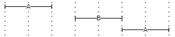
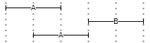
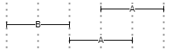
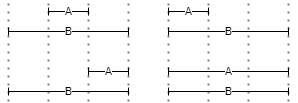
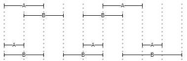
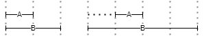
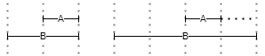

# Query

- [Query](#query)
  - [Pair](#pair)
    - [Pair Name](#pair-name)
    - [Pair Value](#pair-value)
    - [Pair Operator](#pair-operator)
  - [Logical Operators](#logical-operators)
  - [Location Operators](#location-operators)
    - [Near](#near)
    - [Before](#before)
    - [After](#after)
    - [Inside](#inside)
    - [Overlaps](#overlaps)
    - [Lalign](#lalign)
    - [Ralign](#ralign)
  - [Sections](#sections)
  - [Higher Order Languages](#higher-order-languages)

The Pythia query language is used to build SQL-based queries from much simpler expressions.

💡 [Details about translation](sql) from this language to SQL.

As explained about the [Pythia model](index#model), the index is just a set of _objects_, which in most cases represent _tokens_ ("words"), but can also represent sentences, verses, paragraphs, or any other text _structure_. Each of these objects has any number of metadata (named _attributes_). A search gets to these objects via their metadata.

So, a search essentially matches an attribute with a value using some comparison type. This matching is the core of any search, and represents what is called a _pair_, i.e. the union of an attribute's name with a value via a comparison operator.

A query can consist of a _single pair_, or connect _more pairs_ with a number of logical or positional (location) operators, optionally defining precedence with brackets.

## Pair

Each pair, whatever the entity it refers to, is wrapped in square brackets, and includes a name, an operator, and a value, or just a name when we just test for its existence (for privileged attributes only: see below). The query syntax is thus:

```txt
[NAME OPERATOR "VALUE"]
```

### Pair Name

The name is just the name of any valid attribute for the type of object we want to search.

From the point of view of the user all the attributes are equal, and can be freely queried for each item, either it is a document, a token, or a structure. Yet, internally some of these attributes are **privileged**, in the sense that they are considered _intrinsic_ properties of the objects.

>🔧 Privileged attributes are stored in a different way in the index, as they are directly assigned as intrinsic properties of objects. All the other attributes, which are extensible, are rather linked to objects and stored separately from them.

The names of privileged attributes are reserved; so, when defining your own attributes, avoid using these names for them. The reserved names are:

- _document_'s privileged attributes: `id`, `author`, `title`, `date_value`, `sort_key`, `source`, `profile_id`.
- _span_'s privileged attributes: `id`, `p1`, `p2`, `index`, `length`, `language`, `pos`, `lemma`,
`value`, `text`.

👉 Attribute **names** are case-insensitive.

Attribute names referring to _structures_ are prefixed with `$`, which distinguishes them from token attributes in the query (there is no possibility of confusing them with document attributes, as these are in a separate section).

For instance, a structure representing a single verse in a poetic text might have name `l` (=line), and would be represented as `$l` in the query language.

The pairs including non-privileged attributes may omit the operator and value when just testing for the existence of the attribute. This is only syntactic sugar: `$l` is equivalent to `$name="l"`. Instead, `$l="1"` refers to a non-privileged attribute named `l` with value equal to `1`.

### Pair Value

Attribute **values** are always included in double quotes `""`, even when they are numeric. The syntax of the value may vary according to the operator selected. For instance, if you are using a wildcard matching operator, characters `?` and `*` will represent wildcards rather than literals.

>Optionally, you can include _escapes_ inside the quotes with the form `&HHHH;` where `HHHH` is the Unicode hex (BMP) character code to be represented.

### Pair Operator

The available pair operators are 14, inspired by CSS attribute selectors:

- `=` **equals** (textual comparison, literal).
- `<>` **not equals** (textual comparison, literal).
- `*=` **contains** (uses a `LIKE` expression, literal).
- `^=` **starts with** (uses a `LIKE` expression, literal).
- `$=` **ends with** (uses a `LIKE` expression, literal).
- `?=` **wildcards** (uses a `LIKE` expression). Allowed wildcards are `?`=any single character, and `*`=any number of any characters.
- `~=` **regular expression** (with different SQL implementations, e.g. `dbo.RegexIsMatch('text', 'expr')` in SQL Server, `REGEXP` function in MySql, `~` in PostgreSQL).
- `%=` **fuzzy matching** with a treshold. The default treshold value is 0.9; you can specify a different treshold by adding it to the end of the value, prefixed by `:`. For instance, `[value%="chommoda:0.75"]`, or just `[value%="chommoda"]` to use the 0.9 treshold.
- **numeric** comparison operators: `==`, `!=`, `<`, `>`, `<=`, `>=`. These can be applied to numeric values only.

>🔧 Technically, attributes values are all modeled as strings, so that they can represent anything; but when using numeric operators, these values will be converted into (and thus treated as) numeric values. This implies that in constrast with systems like e.g. Lucene, where numeric values are handled as strings so that for instance you have to store `0910` to let it compare correctly with `1256`, this is not required for Pythia; here, you just have to use the numeric operators, which implicitly cast the string value into a number.

Thus, for instance this pair:

```txt
[value]="example"
```

just finds the word "example". Here, you can replace the `=` operator with any other one (except of course the numeric operators, as in this sample we are looking for text); so, you might type:

```txt
[value]^="exam"
```

to find all the words starting with `exam`, or:

```txt
[value]$="ple"
```

to find all the words ending with `ple`; etc.

Of course, you are not limited to a single pair. Multiple pairs can be _connected_ via logical or location operators, and precedence can be expressed by parentheses.

## Logical Operators

A different set of **logical** operators can be used according to their context (section, see [below](#sections)):

- in the _document section_: `AND`/`OR`/`AND NOT`, optionally grouped by `()`.
- in the _text section_: `OR` or location operators, optionally grouped by `()`.

>Location operators implicitly are all in an `AND` relationship with their left node. In fact, `AND` as a standalone operator is not defined, as in the context of a concordance search engine it would make little sense to find 2 words which happen to be at _any_ distance within the same document. Rather, a positional relationship is always implied by an AND to make the search meaningful (we are looking for connected words in some linguistically motivated context, rather than for documents matching several words, whatever their mutual relationships).

## Location Operators

Location operators are specializations of `AND` with added conditions based on the position of the objects in their document. All the positions are based on token positions.

Location operators have one or more **arguments**, expressed between brackets after their name. Arguments can be specified in any order; each is prefixed by its name, followed by an equals sign and its value. For instance, `BEFORE(m=0,s=l)` specifies arguments `m` with value 0, and `s` with value `l`.

For your reference, all the arguments names are listed here, but not all of the operators use all of them:

- `n`: minimum distance (0-N). Defaults to 0 if not specified.
- `m`: maximum distance (0-N). Defaults to `int`'s max value (a 32-bits signed integer) if not specified.
- `s`: structure context name. When specified, the second pair must be found inside the same structure including the first pair.
- `ns`: minimum distance (0-N) from structure start.
- `ms`: maximum distance (0-N) from structure start.
- `ne`: minimum distance (0-N) from structure end.
- `me`: maximum distance (0-N) from structure end.

👉 All the location operators can be **negated** by prefixing a `NOT` (note that in this case the `s` argument is not allowed, as it would be meaningless).

### Near

▶️ `NEAR(n,m,s)`: filters the left expression so that it must be _near_, i.e. at the specified distance (ranging from a minimum -`n`- to a maximum -`m`-) from the second one, either before or after it. For instance, in Figure 1 A is either before or after B; the distance between the left A and B is 1, while the distance between B and the right A is 0.



- Figure 1 - NEAR

### Before

▶️ `BEFORE(n,m,s)`: filters the left expression so that it must be _before_ the second one, at the specified distance from it. For instance, in Figure 2 two instances of A are before B, either at distance 1 or 0.



- Figure 2 - BEFORE

### After

▶️ `AFTER(n,m,s)` filters the first expression so that it must be _after_ the second one, at the specified distance from it. This operator mirrors `BEFORE`. For instance, in Figure 3 two instances of A are after B, either at distance 1 or 0.



- Figure 3 - AFTER

### Inside

▶️ `INSIDE(ns,ms,ne,me,s)`: filters the first expression so that it must be _inside_ the span defined by the second one, optionally at the specified minimum and/or maximum distance from the container start (`ns`, `ms`) or end (`ne`, `me`). For instance, in the 4 examples of Figure 4 A is always inside B, whatever its relative position and extent.



- Figure 4 - INSIDE

### Overlaps

▶️ `OVERLAPS(n,m,s)`: filters the first expression so that its span must overlap the one defined by the second expression, optionally by the specified amount of positions. Here `n` represents the minimum required overlap, and `m` the maximum allowed overlap. For instance, in the 4 examples of Figure 5 there is always overlap (of extent 1) between A and B.



- Figure 5 - OVERLAPS

### Lalign

▶️ `LALIGN(n,m,s)`: filters the first expression so that its span must _left-align_ with the one defined by the second expression: `A` can start with or after `B`, but not before `B`. Here, `n` and `m` specify the minimum and maximum offsets from start. For instance, in Figure 6 the left A/B pair has a perfect left alignment (distance=0), while the right pair has offset=1 from the left-alignment position.



- Figure 6 - LALIGN

### Ralign

▶️ `RALIGN(n,m,s)`: filters the first expression so that its span must _right-align_ with the one defined by the second expression: `A` can end with or before `B`, but not after `B`. This mirrors `LALIGN`. For instance, in Figure 6 the left A/B pair has a perfect right alignment (distance=0), while the right pair has offset=1 from the right-alignment position.



- Figure 7 - RALIGN

>⚙️ In the current implementation, each operator corresponds to a [PL/pgSQL](https://www.postgresql.org/docs/current/plpgsql.html) function, conventionally prefixed with `pyt_`. These functions receive the arguments listed above in addition to the positions being tested, which are handled by the search system.

💡 The potential of these alignment operators may not be immediately evident, but they can provide a lot of power for contextual searches.

To start with, you can search for a word before or after or near another word, specifying the minimum and maximum distance, and also limiting results to those words included in the same larger encompassing structure (e.g. a sentence). This way, we are not limited to a mechanical numeric criterion, like a raw numeric distance, which might be useless when e.g. you are looking for pairs of words, but one of these happens to be at the end of a sentence, and the other one at the beginning of the next one.

In fact, the power of these operator shines when dealing with larger structures; for instance, you can search for a word at the beginning of a verse, i.e. a word left-aligned with a verse with maximum distance=0, or at its end, i.e. right-aligned with maximum distance=0, etc.

Remember that in Pythia everything is an object with properties (including start/end positions, where applicable), whether it's a single word or a larger linguistic structure like phrase, sentence, verse, or even non-strictly linguistic structures like typographic entities as paragraphs. Such objects all have a start and an end position, making them like segments. A token is just a segment where by definition start and end positions coincide, because positions are token-based. So, once any span of text, whatever the analysis level which defined it, has been defined in this geometrical way, you are free to look for any type of alignment between any types of segments, and additionally play with the operation arguments for minimum, maximum, and embracing structure. Once again, this is the effect of a higher abstraction level in the model, the same which "de-materialized" text from a sequence of characters into a set of objects.

## Sections

Text objects (tokens and structures) are not the only available objects in Pythia; there are also documents and corpora. These are used to further delimit the results to documents matching a specific query, or to predefined sets of documents (corpora).

To allow for a simpler syntax, conditions about corpora, documents, and text are specified in three different sections of a query:

1. **corpus** filters (optional). The corpus section is just a list of corpora IDs in `@@...;`. For the section to match, it is enough to match any of the listed corpora IDs.

2. **document** filters section (optional). The documents set is represented by an expression of pairs inside `@...;`, connected by `AND`/`OR`/`AND NOT`/`OR NOT`, and optionally grouped by `()`.

3. **tokens** and **structures** section (required). An expression of pairs, each inside `[...]`, connected by `OR` or a location operator (e.g. `NEAR`), and optionally grouped by `()`. Location operators would not be useful in documents and corpora sections, as documents and corpora do not refer to positions.

Thus, a query's skeleton is (whitespaces are not relevant, but I place sections in different lines just to make the query more readable):

```txt
@@...corpus...;
@...document...;
...tokens and structures...
```

where only the last section is required, while the first two refer to the search scope, as defined by documents (`@`) and their groups (corpora: `@@`).

As a sample, consider this query (whitespaces are irrelevant; see below for the details):

```txt
@@neoteroi rhetoric;
@[author="Catullus"] AND ([date_value<="0"] OR [category="poetry"]);
[value="hionios"] OR ([value="sic"] BEFORE(m=0,s=l) [value="mater"] BEFORE(m=0,s=l) [value="sic"])
```

Here we have:

- a _documents_ section, including 3 pairs for author, category, and date value, connected by logical operators and grouped with parentheses. Here we must match all the documents whose author is `Catullus`, having either their category equal to `poetry` or their date value less than `0` (which for these documents means B.C.). This limits the search only to the documents matching these criteria.

- a _text_ (=tokens/structures) section, including 4 pairs; the first pair (`hionios`) is an alternative match for the second expression, including another value (`sic`). This value is further filtered by its location with reference to the next 2 words, `mater` and `sic` again. Location operators being binary, each connects the left token (filter target) with the right token (filter condition). So, in this example `mater` adds a filter to the first `sic`; in turn, the second `sic` adds a filter to `mater`. This means that we must match a token with value `sic`, but only before to a token with value `mater` at a distance of no more than 0 token positions (`m=0` means a maximum distance of 0), and inside the same verse (`s=l` means a common ancestor structure named `l`=line); in turn, this `mater` must appear immediately before another `sic`, and inside the same verse. So, at line 5 of Catullus' poem 84, dated one century before Christ, `credo, >sic mater, sic< liber avunculus eius`, this query matches the first `sic` only as it happens to be immediately followed by `mater`, which in turn must be immediately followed by another `sic`.

The following picture represents the syntax tree for a shorter version of the above query:

```txt
@[author="catullus"] AND ([category="poetry"] OR [datevalue<"0"]);[value="sic"] BEFORE(m=0,s=l) [value="mater"]
```


## Higher Order Languages

The Pythia query language as described above is thus very powerful, but for some audiences it might just be too much. This is the case for a part of the audience targeted by the frontend built for the [Atti Chiari](https://attichiari.unige.it) project, code-named Minerva, which addresses not only linguists and jurists, but also a broader public of non-specialized users.

In this case, it is right the abstraction level adopted by this model which allows to provide alternative ways of querying the same index. More generally, Pythia just stores its index in a standard [relational database](storage) (currently PostgreSQL), which allows third parties to reuse it in any way, independently from its software. But even within this software stack, like in the case of Minerva, the high abstraction level easily provides alternatives.

In the case of Minerva, a new query layer has been added on top of the existing one, acting as an alternative, "simple" query language, as opposed to the default one illustrated above. This is just another DSL, targeting an Italian audience and much nearer to natural language expression.

In this DSL, users just build some predefined Italian sentences to query the corpus. Apart from the simplest, one-word query, which just corresponds to the word you want to find, Figure 8 shows the various paths which can be followed to build a sentence, from left to right.


- Figure 8 - The Minerva additional DSL

For instance, a user can start from "trova" and then pick an object, like "parola", "locuzione", "lemma", "forestierismo", "latinismo", "anglicismo" on one branch, or "tutte le parole", "tutti i forestierismi", "tutti i latinismi", "tutti gli anglicismi" on another one. The former branch allows to specify expressions corresponding to comparison operators, like "iniziante per", "terminante per", "contenente", "corrispondente a" (for wildcard matches), or "(molto/poco) simile a" for fuzzy matches; these are then followed by the value being compared.

Then, both branches converge in the optional "come" clause, which introduces search criteria derived from POS tagging, like noun, adjective, verb, one of its specific moods or tenses, etc.

Optionally, this can be followed by an "in" clause, which adds search criteria related to typographic features (extracted from the original DOCX documents), like bold, italic, or underline.

Finally, we can add a positional clause, like at sentence start or end, or near to, attached to (=near with zero distance), before, or after, which in turn can be followed by yet another expression like that introduced by "trova", in a recursive way.

In most cases, where these criteria require parameters the DSL supplies some meaningful defaults, thus hiding more complex details to the end users. Once the query expression is complete, it gets translated into the default DSL illustrated above, thus allowing users to have a glance at it if they want to learn it by example, or just customize some of its parameters.

Thus, users can just ask the system 'trova un anglicismo poco simile a "provider"' and get this Italian sentence automatically translated into a query like:

```txt
[language="eng"] AND [value%="provider:0.5"]
```

This query just looks for any word having both these properties:

- language = English;
- value similar to "provider" with a similarity threshold equal to 0.5 (in a range from 0 to 1, where 1 is equal).

The query will thus find any English word which is broadly similar to "provider". Should you just want to find any foreign word in these Italian texts, you could just replace "anglicismo" with "forestierismo", and get a slightly different query:

```txt
[language<>"ita"] AND [value%="provider:0.5"]
```

In this case, the DSL has built a query which finds any non-Italian word, as of course in this case we deal with an Italian corpus, where any non-Italian word is considered as foreign. On passage, legal acts are full of foreign words especially drawn from Latin, and this is thus a very useful feature in linguistic or juridic searches.

Speaking about Latin, this DSL also allows for searching not just a single word, but also a full phrase, as in most cases juridic texts use them in a highly formular way. This is made possible by the fact that the underlying Pythia engine deals with any span of text, representing any type of textual structure, whether it's a word, or a phrase, sentence, verse, etc. In this case, a query expression like 'trova la locuzione "pro tempore"' would thus be translated into `[$fp-lat] AND [_value="pro tempore"]`, where `$` is the prefix used for non-token spans ("structures") and `fp-lat` the name chosen during indexing for Latin foreign phrases (in this case, the `_` prefix before `value` tells the engine to refer this attribute to the mentioned structure, rather than to a token).

Of course, any valid path along the expression tree can be exploited; so one might modify this expression like 'trova la locuzione iniziante per "pro"' to get `[$fp-lat] AND [_value^="pro"]`, or 'terminante per "tempore" to get `[$fp-lat] AND [_value$="pro"]`; in both cases, the only difference is the comparison operator.

Again, we could add more clauses about the relative position of the text being searched, like in 'trova la parola "invero" a inizio di frase"; this would be translated into:

```txt
[value="invero"] LALIGN(m=0) [$snt]
```

which means looking for a word whose value is equal to "invero", left-aligned with a sentence object, only when the maximum distance (`m`) from its start is 0. This will effectively find that word only when it appears at the beginning of a sentence.

Even these short sample expressions should be enough to show how they can be a powerful way for exploiting the potential of the underlying engine while preserving a very easy user experience.In fact, in Minerva this additional query layer just builds on top of the base one, as a higher-order DSL. In this case, we have a twofold translation:

1. the Italian query DSL is translated into the base query DSL.
2. the base query DSL is translated into [SQL](sql).

Alternatively, Minerva users can also use the base query DSL, either directly or from a translated expression (when they want to modify it); in both cases, we will end up with the same SQL code. Of course, a third-party software might either use these DSLs, or just bypass them and use its own, or even no DSL at all, when directly talking to the underlying database engine via SQL or some helper tool (e.g. an ORM mapping technology).

>⚙️ Technically, both DSLs are defined via [ANTLR](antlr); in the case of the Pythia engine, ANTLR generates a C# parser integrated in its backend, while in the case of Minerva its additional DSL is limited to the frontend it applies to, so there ANTLR generates a Typescript parser directly leveraged in the UI. To inspect the results of DSL to SQL translation you can also use the [Pythia CLI tool](cli#build-sql-command).

Finally, an even more natural addition implemented in Minerva on top of this DSL is the consequence of using natural-language like expressions for it: in fact, as an alternative input method the UI leverages the browser's builtin speech recognition capabilities to let users just say what they want to find. In this case, the speech is converted into text, validated and integrated by the software (for instance to introduce quotes around the values being searched), and finally translated just as it had been entered by typing it. This provides an additional and very natural way for querying this index, especially fit to wider audiences.
